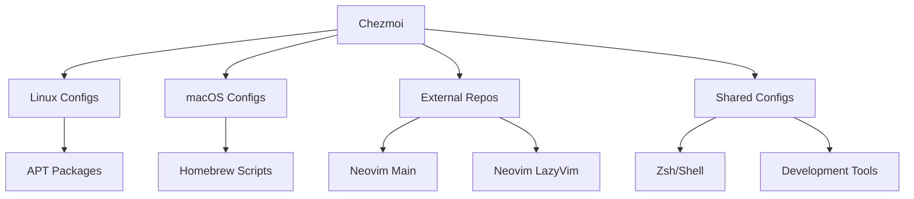

<div align="center">
  <h1>🏠 Dotfiles</h1>
  <p>Personal dotfiles and system configuration managed with <a href="https://chezmoi.io">chezmoi</a></p>
  
  
  
  
  
</div>

## 🚀 Features

- **Chezmoi-powered** with secret management and machine-specific overrides
- **External Neovim configs** - Multiple Neovim setups from separate repository
- **Automated setup scripts** - Complete system bootstrapping for macOS
- **Brew/Apt duality** - supports both Homebrew and Apt packages
- **Universal symlinks** where needed (via Chezmoi templates)

## 🌟 macOS-Specific Features

- **Automated Homebrew setup** via `brewinstall.sh`
- **System preferences configuration** via `macconfig.sh`
- **Application installation and setup** via `macapps.sh`
- **Font management** for development environments
- **Bat syntax highlighting** with custom themes

## 🛠️ Tooling Stack



## File Structure 📂 (Chezmoi-managed)

```bash
~/.local/share/chezmoi/
├── .chezmoiexternal.toml    # External repository management
├── .chezmoiignore          # Files to exclude from home
├── chezmoi.toml            # Configuration matrix
├── home/                   # Dotfiles source (to be moved to root)
│   ├── dot_config/         # ~/.config/ - Application configs
│   ├── dot_curlrc          # ~/.curlrc - curl configuration
│   ├── dot_env             # ~/.env - Environment variables
│   ├── dot_gitconfig       # ~/.gitconfig - Git configuration
│   ├── dot_gitmessage      # ~/.gitmessage - Git commit template
│   ├── dot_ideavimrc       # ~/.ideavimrc - IntelliJ Vim plugin
│   ├── dot_shellrc.d/      # ~/.shellrc.d/ - Shell modules
│   ├── dot_tmux.conf       # ~/.tmux.conf - tmux configuration
│   ├── dot_zprofile        # ~/.zprofile - Zsh profile
│   ├── dot_zshrc           # ~/.zshrc - Zsh configuration
│   └── dot_zshrc.d/        # ~/.zshrc.d/ - Zsh modules
└── scripts/                # Setup and maintenance scripts
    ├── setup.sh            # Main setup orchestrator
    ├── brewinstall.sh      # Homebrew packages installation
    ├── macconfig.sh        # macOS system preferences
    ├── macapps.sh          # macOS applications setup
    ├── fontinstall.sh      # Programming fonts installation
    ├── bat-theme.sh        # Bat syntax highlighting
    ├── extras/             # Additional utilities
    └── programs/           # Program-specific configurations
```

## 🎯 External Configurations

### Neovim Setup

Managed via `.chezmoiexternal.toml` from [walkeratmind/nvim](https://github.com/walkeratmind/nvim):

- **Main Config**: `~/.config/nvim` - Personal Neovim setup
- **LazyVim Config**: `~/.config/nvim-lazy` - LazyVim distribution

```bash
# Switch between configurations
nvim                          # Main config
NVIM_APPNAME=nvim-lazy nvim   # LazyVim config
```

## ⚡ Setup

### Prerequisites

```bash
# Install Chezmoi
sh -c "$(curl -fsLS get.chezmoi.io)"
```

### Bootstrap (Both Platforms)

```bash
# Initialize and apply dotfiles
chezmoi init --apply walkeratmind/dotfiles

# This will automatically:
# ✅ Install dotfiles to home directory
# ✅ Pull external Neovim configurations
# ✅ Exclude project files (README, scripts) from home
```

### Platform-Specific Setup

**macOS Complete Setup:**

```bash
# Navigate to chezmoi source
cd ~/.local/share/chezmoi

# Run automated setup
./scripts/setup.sh              # Main orchestrator
./scripts/brewinstall.sh        # Install Homebrew packages
./scripts/macconfig.sh          # Configure macOS preferences
./scripts/macapps.sh            # Install macOS applications
./scripts/fontinstall.sh        # Install programming fonts
./scripts/bat-theme.sh          # Configure bat theme
```

**Linux:**

```bash
# Manual package installation based on your distro
# Configurations will work cross-platform
```

## 🔧 Maintenance

| Task | Command |
|------|---------|
| Add new config | `chezmoi add ~/.config/foo` |
| Edit managed file | `chezmoi edit ~/.zshrc` |
| Sync changes | `chezmoi apply` |
| Update externals | `chezmoi apply --refresh-externals` |
| Diff changes | `chezmoi diff` |
| Check status | `chezmoi status` |

### External Repository Updates

```bash
# Update Neovim configs (respects refreshPeriod)
chezmoi apply

# Force update external repos (ignores refreshPeriod)
chezmoi -R apply
```

## 🛠️ Configuration Highlights

### Shell Environment

#### Nushell

- **Nushell** with custom aliases
- helper commands like `sm` for session manager for bother `zellij` and `tmux`
- commands: `pm` for project navigation and switch similar to tmux-sesionizer using fzf. Inspired from [zellij-sessionizer](https://github.com/silicakes/zellij-sessionizer/tree/main)
   - you can check `dot_config/nushell/integrations/project-manager.nu` and modify/add paths for your projects directory.

#### ZSH

- **Zsh** with modular configuration (`dot_zshrc.d/`)
- **Shell modules** in `dot_shellrc.d/` for cross-shell compatibility
- **Environment management** via `dot_env` and `dot_zprofile`

### Development Tools

- **Git** with custom config and commit templates
- **tmux** for terminal multiplexing
- **curl** with personalized settings
- **IntelliJ IDEA Vim** plugin configuration

### External Dependencies

- **Neovim configurations** from separate repository
- **Cross-platform compatibility** maintained through Chezmoi templates
- **Automated updates** with configurable refresh periods

## 📚 References

> With gratitude to these inspirations:

- [victoriadrake](https://github.com/victoriadrake/dotfiles) - Cross-platform approach
- [tomnomnom](https://github.com/tomnomnom/dotfiles) - Minimalist philosophy
- [rhoit](https://github.com/rhoit/my-config) - Modular configurations
- [Chezmoi Documentation](https://www.chezmoi.io/user-guide/command-overview/) - External repository management

---

<div align="center">
  <p>⭐ Star this repo if you find it helpful!</p>
  <p><strong>Ready for both Linux tinkering and macOS productivity</strong> 🚀</p>
</div>
