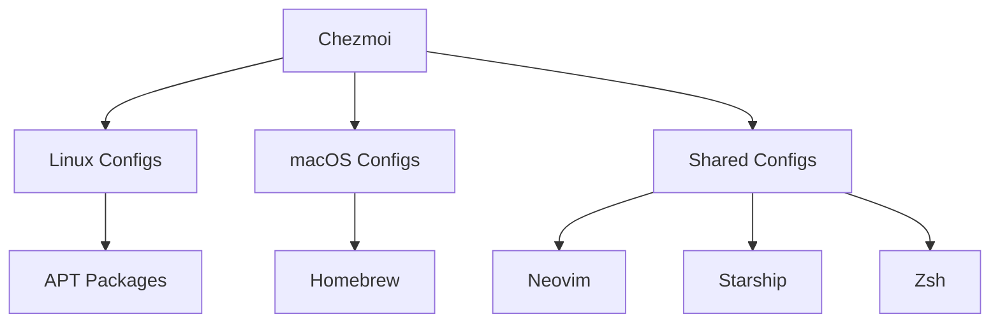

# dotfiles 🖥️ for Linux 💻 & macOS 


> **Hybrid dotfiles management** powered by [Chezmoi](https://www.chezmoi.io/) with cross-platform support

## 🚀 Features

- **Single-source truth** for both Linux and macOS configurations
- **Chezmoi-powered** with secret management and machine-specific overrides
- **Brew/Apt duality** - supports both Homebrew and Apt packages
- **Universal symlinks** where needed (via Chezmoi templates)

## 🛠️ Tooling Stack



## File Structure 📂 (Chezmoi-managed)

```bash
~/.local/share/chezmoi/
├── dot_config/
│   ├── nvim/       # Cross-platform Neovim config
│   ├── starship/   # Universal prompt
│   └── yabai/      # macOS window manager
├── dot_zshrc       # Base Zsh config
├── run_once_install-deps.sh # OS-specific setup
└── chezmoi.toml    # Configuration matrix
```

## ⚡ Setup

### Prerequisites
```bash
# Install Chezmoi
sh -c "$(curl -fsLS get.chezmoi.io)"
```

### Bootstrap (Both Platforms)
```bash
chezmoi init https://github.com/yourusername/dotfiles
chezmoi apply
```

### Platform-Specific Extras

**macOS:**
```bash
brew bundle --file=~/.local/share/chezmoi/dot_Brewfile
launchctl load ~/.local/share/chezmoi/dot_Library/LaunchAgents/*.plist
```

**Linux:**
```bash
sudo ~/.local/share/chezmoi/run_once_install-deps.sh
```

## 🔧 Maintenance

| Task | Command |
|------|---------|
| Add new config | `chezmoi add ~/.config/foo` |
| Edit managed file | `chezmoi edit ~/.zshrc` |
| Sync changes | `chezmoi apply` |
| Diff changes | `chezmoi diff` |

## 🌟 macOS-Specific Features

```bash
# Kanata keyboard remapping (via launchd)
chezmoi add ~/Library/LaunchAgents/com.rakesh.kanata.plist
```

## References 📚

> With gratitude to these inspirations:

- [victoriadrake](https://github.com/victoriadrake/dotfiles)
- [tomnomnom](https://github.com/tomnomnom/dotfiles)
- [rhoit](https://github.com/rhoit/my-config)

